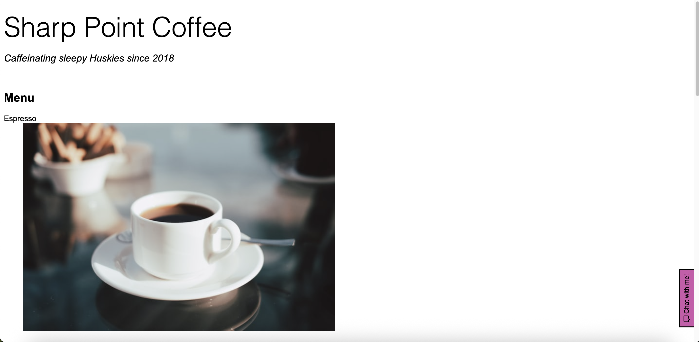

# eGain SWE
This repository contains my solution to the eGain SWE Take-Home Assignment. \
**Scenario**: Helping a customer track a lost package. \
**Languages**: HTML/CSS/JavaScript (basic web interface). \
**Overview:** Chatbot that uses keyword-based recognition and "steps" for tracking chat progression. Includes text input and suggestion bubbles for users to send messages, and error handling for unexpected user inputs.

## Setup/installation instructions
**Creator setup:**
1. Create eGain repository that includes a README file.
2. Create eGain folder on desktop.
3. Git clone eGain repository into eGain folder.
4. Create HTML, CSS, and JavaScript files, and image folder.
5. Begin coding and adding relevant images. Save, add, commit, and push every so often. \

No additional installation required as creator has existing GitHub account.  

**Audience setup:**
- No setup or installation required.
- Live link to visit the page via GitHub Pages available [here](https://aaliyahjv.github.io/eGain-swe "Sharp Point Coffee")

## Brief explanation of your approach
**Goal:** Implement a chatbot that addresses users' problems quickly and easily in a more natural language.

**Implementation and design steps:**
1. Research! Experience a chatbot of another company, and ask it to find a lost package.
2. Design! Create a simple chatbot conversation flow using research and interests of self and others.
3. Code!
    - HTML: add DOCTYPE, head with meta, title, and links, body with chat container (including chat box and input row), chat button, and suggestion buttons (very last thing added as it was of less importance compared to other components), in that order.
    - CSS: style page to get a sense of what the chatbot looks like before testing with input. Ended with styling after making sure Javascript code was functioning correctly.
    - JavaScript: save elements from HTML, create variables, create sendMessage function that sets up user input, create appendMessage function that displays messages, create botMessage function that controls the chatbot's conversation flow, add code that starts the conversation, add event listener for chat button, add suggestMessage function that creates and displays buttons, and create suggestion button arrays where it seems fit, in that order.

## Screenshots/examples of the chatbot in action
Chat button displayed on website \

Opening the chatbot \

Sending a message that doesn't contain a keyword \

Using suggestion buttons to fill user's text input \
 

Sending a message that contains keyword "track" or "lost" (conversation starts to flow) \

Sending an invalid order number (less than 6 digits or 6 digits but not in list of orders) \
 \

Sending a valid order number (6 digits and exists in list of orders) \
